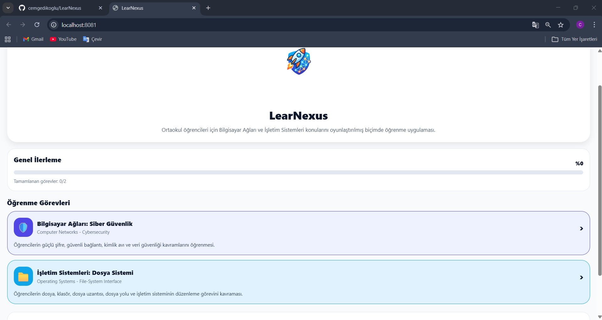
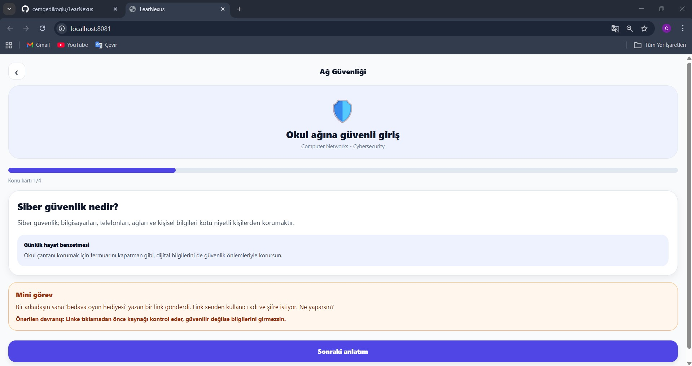
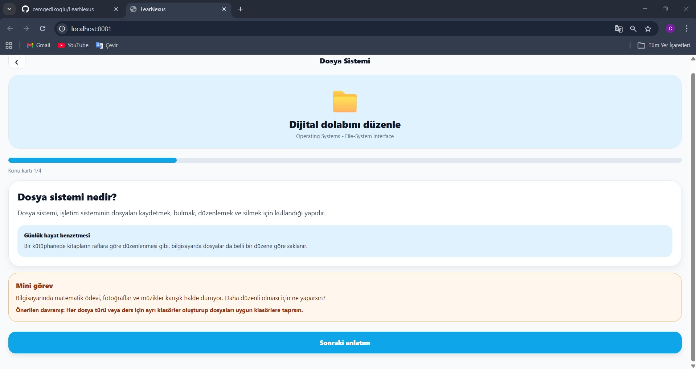
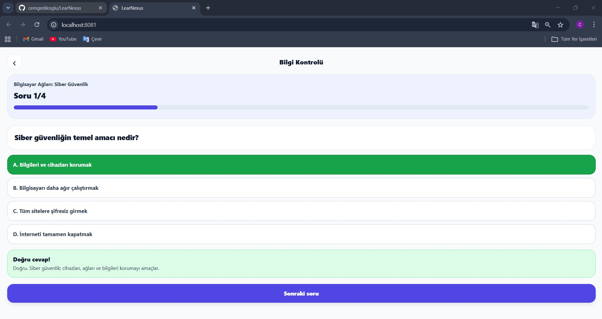
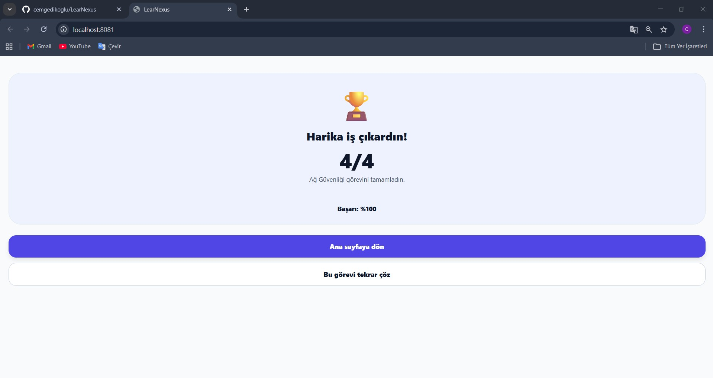

# LearNexus Mobile Learning Application

LearNexus is a mobile educational application developed to help middle school students learn the fundamentals of Operating Systems and Computer Networks.

## Project Team

**Group 2**

- Cem GEDİKOĞLU-22091037
- Çağrı KAÇMAZ-22091016
- İlknur AKSARAY-20091001
- Yusuf KUTLU-22091017

## About the Project

This project focuses on simplifying complex computer science concepts for middle school students. The application presents selected topics with short explanations, real-life examples, mini tasks, and quiz questions.

The specific topics covered in the project are:

| Course | Topic |
|---|---|
| Computer Networks | Cybersecurity |
| Operating Systems | File-System Interface |

## Application Workflow

The learning process is designed with a structured flow:

1. **Topic Selection:** Users choose the subject they want to study.
2. **Theoretical Instruction:** The app provides short and clear explanations of core concepts.
3. **Real-Life Examples:** Technical concepts are connected with everyday scenarios.
4. **Conceptual Mini-Tasks:** Small tasks help students think about the topic.
5. **Assessment Quiz:** Interactive questions are used to check understanding.
6. **Instant Feedback and Score Screen:** Students receive feedback and see their final score.

## Demo Screenshots

The following screenshots show the main screens and learning flow of the LearNexus application.

### Main Screen

### Cybersecurity Module

### File-System Module

### Quiz Screen

### Result Screen

## Technologies Used

- React Native
- Expo
- JavaScript
- GitHub for version control

## Future Improvements

In future versions, the application can be improved with more learning modules, simple animations, user progress tracking, badges, different difficulty levels, and more interactive mini tasks.
